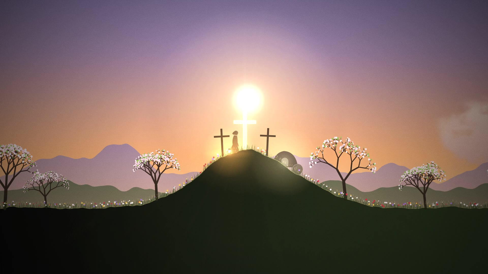

# LUMEN

A 60-second wordless 2D animated short about Christian faith. Every frame, note and sound is generated from code;
there are no image, video or audio assets. (This folder is independent of the "Last Light" project at the repo root.)



**Watch:** [`output/lumen.mp4`](output/lumen.mp4) (1920×1080, 30 fps, H.264 + AAC stereo)

## Story
1. **Creation (0–9 s)** — In darkness a single point of light appears, its rays forming a cross. "Let there be light":
   it bursts into a nebula and a sun, and the camera falls toward a storm-covered world.
2. **The wanderer (9–19 s)** — A cloaked traveller crosses a dead plain in the rain with a small lantern.
   Lightning, a gust of wind; the lantern goes out and he falls to his knees.
3. **Prayer (19–29 s)** — He prays. A ray breaks through the clouds and a dove of light descends, circles him and
   rekindles the lantern, then flies to a distant hill where three crosses stand.
4. **The way (29–39 s)** — He follows, leaving footprints of light, and kneels at the foot of the centre cross as the
   clouds spiral overhead. His hand touches the wood — the cross blazes, and the storm is torn open.
5. **Resurrection (39–51 s)** — Dawn. A wave of new life runs out from the cross: grass, flowers, dead trees in blossom.
   The stone rolls away from the tomb, which fills with light. Pilgrims arrive from both sides and the cross passes its
   fire to their lanterns; doves cross the sky; a linen cloth rests on the empty cross. All raise their lanterns.
6. **Glory (51–60 s)** — The lights rise into the sky and become a great rose window, which folds back into the single
   point of light from the beginning. The music closes on a plagal "Amen" (G → D).

Master timeline (the shared clock for picture, music and SFX): [`story/storyboard.md`](story/storyboard.md).

## How it is made
| Part | File | Technique |
|---|---|---|
| Picture | `visuals/film.js`, `visuals/lib.js` | HTML5 Canvas 2D; each frame is a pure function of t. Parallax camera over sky / cloud / 2 ridge / main layers, domain-warped fBm nebula, procedural cloud sprites (storm, lightning-lit, dawn tints) incl. a rotating vortex, midpoint-displacement lightning, 2D FK character rig (walk / kneel / pray / reach / raise) with a cloth-like cloak and per-figure light tinting, recursive trees that blossom, ~1000 grass blades and flowers driven by a "wave of life" front, light beam with motes, dove of light with sparkle trail, crowd rig, procedural stained-glass rose window, half-res emissive layer with a 3-level bloom, flashes, grade, vignette, film grain |
| Render | `render/render.js` | Headless Chromium (Playwright), 4 parallel pages → JPEG → ffmpeg/libx264 |
| Music | `audio/music.py` | Synthesised sacred score: formant-synthesis choir (6–8 detuned voices per part), additive pipe organ with chiff and 16' pedal, string ensemble, modal timpani and bells; D minor → D major Picardy climax at 38 s, original 4-part chorale, plagal Amen; hall + cathedral convolution reverb |
| Sound effects | `audio/sfx.py` | Procedural rain, wind, thunder, footsteps (mud → stone), lantern, dove wings, light bursts, birdsong, distant bells, shared synthetic reverbs |
| Mix | `audio/mix.py` | Stem sum with light ducking, bus compression, loudness normalisation to about −15 LUFS, true-peak limit ≤ −1 dBTP |

## Rebuild (from the repo root)
```bash
pip install numpy scipy soundfile pyloudnorm pedalboard      # ffmpeg with libx264 must be on PATH
python3 lumen/audio/music.py && python3 lumen/audio/sfx.py && python3 lumen/audio/mix.py
node lumen/render/render.js lumen/output/video_silent.mp4 4 30          # needs playwright + chromium
ffmpeg -i lumen/output/video_silent.mp4 -i lumen/audio/mix.wav -c:v copy -c:a aac -b:a 256k -shortest lumen/output/lumen.mp4
```
Preview single frames: `node lumen/render/preview.js /tmp/out 3.3 25.2 38.5 56`.
Open `visuals/index.html#play` in a browser for a silent real-time preview, or `#t=38.2` for a single frame.
